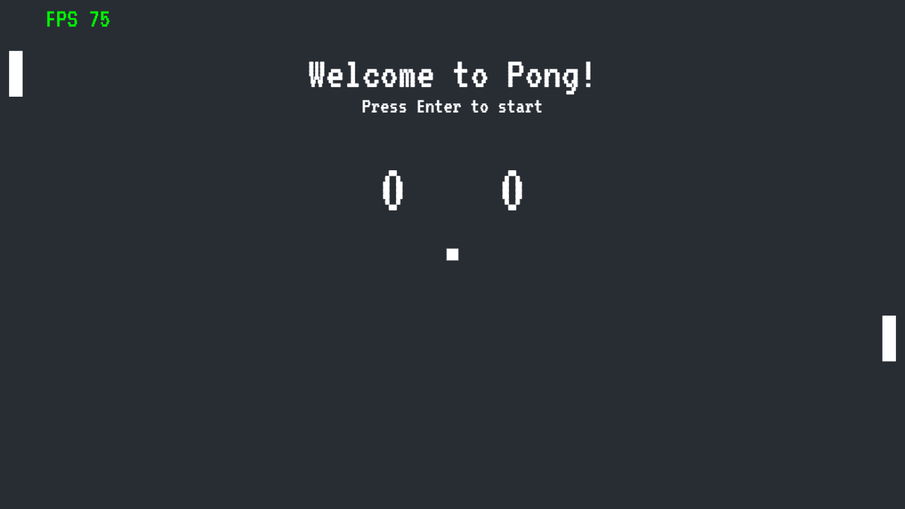

# Pong

The classic [Pong](https://en.wikipedia.org/wiki/Pong) game, created following the course [CS50's Introduction to Game Development](https://cs50.harvard.edu/games/2018/weeks/0/) by Harvard.

## Screenshot



## How to Play

First clone the repository:

```cli
    git clone https://github.com/rafaeldevvv/pong.git
```

Then, go to the repository's folder in your computer and run:

```cli
    npm run dev
```

Then, visit [http://localhost:5173/](http://localhost:5173/) with your browser.

## Author

The name's Rafael Maia. You can find me on [Instagram](https://www.instagram.com/rafaeldevvv), [X](https://www.twitter.com/rafaeldevvv), and [Linkedin](https://www.linkedin.com/in/rafael-maia-b69662263). Or you can send me an email [rafaeldeveloperr@gmail.com](mailto:rafaeldeveloperr@gmail.com).

I am a freelancer, so you can also find me on [Fiverr](https://www.fiverr.com/rafael787) and [Upwork](https://www.upwork.com/freelancers/~01a4dc9692c96839dc).

Check out my last post on [Buy Me a Coffee](https://buymeacoffee.com/rafael.maia/introduction-data-structures) and [Medium](https://medium.com/@rafaelmaiaw/introduction-to-data-structures-f4eea777f363) about Data Structures.

## Donate

Also, if you liked this project, consider [buying me a coffee](https://www.buymeacoffee.com/rafael.maia) ☕. I'd be grateful if you could support my work 😁👍❤!
